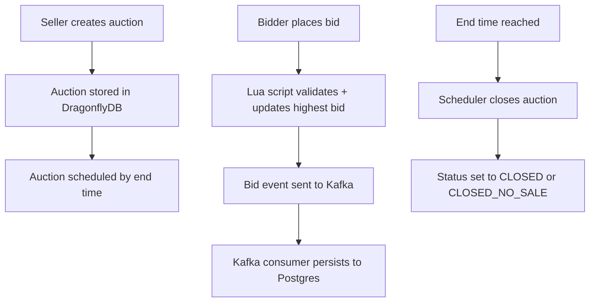

# Bid Engine using DragonflyDB (MVP)

This is an MVP (Minimum Viable Product) auction service backed by DragonflyDB (Redis protocol) as the primary store, with PostgreSQL durability via Kafka.

## About this MVP (Minimum Viable Product) Auction
In this project, **MVP auction** means **Minimum Viable Product** auction. It’s the smallest set of features needed for a working auction that users can actually use and you can validate quickly.

Here’s what that MVP typically includes, and how it works end‑to‑end:

**Core concepts**
- **Auction**: A listing with start/end times, a starting price, and optional reserve price.
- **Bid**: An offer by a bidder to pay a specific amount.
- **Highest bid**: The current winning price.

**Basic flow**
1. **Create auction**
   - Seller provides title, starting price, start time, and end time.
   - Auction status becomes `OPEN` (but bids before `startTime` are rejected).
2. **Place bids**
   - Bids must be **>= starting price** and **> current highest bid**.
   - Each valid bid becomes the new highest bid.
3. **Close auction**
   - When the auction ends (or is closed manually), status becomes `CLOSED`.
   - Highest bid (if any) becomes the winning bid.
   - If there is a reserve price and the highest bid is below it, the auction can be closed with **no winner** (not implemented yet in our MVP, but easy to add).

**What this MVP does**
- Create auctions.
- Accept bids with strict ordering and atomicity.
- Return highest bid + bidder.
- Reserve‑price handling.
- Auto‑closing at end time.
- Close auctions and report the winner.

**What’s *not* in this MVP (yet)**
- Proxy bidding (eBay style).
- Bid increments / rules.
- Notifications and payments.
- Fraud checks or user auth.

## Architecture
- **Write path**: REST -> DragonflyDB (primary) -> Kafka events
- **Durability**: Kafka consumer persists auctions/bids into PostgreSQL
- **Atomic bid placement**: Lua script in DragonflyDB ensures correctness under high QPS

### How the flow works



Statuses used by this MVP:
- `OPEN`: Auction is active and accepts bids (after start time, before end time).
- `CLOSED`: Auction ended with a winning bid (reserve met if set).
- `CLOSED_NO_SALE`: Auction ended without a winning bid (reserve not met or no bids).

## Quick start

```bash
docker compose up -d
./gradlew bootRun
```

## Tests

```bash
./gradlew test
./gradlew integrationTest
```

Integration tests require Docker and use Testcontainers to start DragonflyDB.

## Kafka JSON note

Spring Kafka's `JsonSerializer`/`JsonDeserializer` currently depends on Jackson 2.x types. This project pins `com.fasterxml.jackson.core:jackson-databind` to satisfy that dependency alongside Jackson 3 used by Spring Boot 4.

## REST API

### Create auction
```bash
curl -iL -X POST http://localhost:8080/auctions \
  -H 'Content-Type: application/json' \
  -d '{
    "sellerId": "seller-1",
    "title": "Vintage Watch",
    "description": "1960s model",
    "startingPrice": 1000,
    "reservePrice": 1500,
    "startTimeEpochMs": 1738900000000,
    "endTimeEpochMs": 1738990000000
  }'
```

### Create auction (reserve not met -> no sale)
```bash
curl -iL -X POST http://localhost:8080/auctions \
  -H 'Content-Type: application/json' \
  -d '{
    "sellerId": "seller-1",
    "title": "Rare Coin",
    "startingPrice": 1000,
    "reservePrice": 5000,
    "startTimeEpochMs": 1738900000000,
    "endTimeEpochMs": 1738990000000
  }'
```

If the highest bid is below `reservePrice`, closing the auction returns `CLOSED_NO_SALE` with no winning bidder.

### Place bid
```bash
curl -iL -X POST http://localhost:8080/auctions/{auctionId}/bids \
  -H 'Content-Type: application/json' \
  -d '{
    "bidderId": "user-9",
    "amount": 1200
  }'
```
#### Note: If the action has ENDED, the HTTP status code will be 409.
    status: "ENDED" means the auction’s endTimeEpochMs is already in the past at
    the time you place the bid. When the Lua script returns ENDED, the service does
    not publish a Kafka event, so Postgres never gets a bid row.

### Get auction
```bash
curl http://localhost:8080/auctions/{auctionId}
```

### List top bids
```bash
curl http://localhost:8080/auctions/{auctionId}/bids?limit=50
```

### Close auction
```bash
curl -X POST http://localhost:8080/auctions/{auctionId}/close
```

## Error format

All validation errors use a consistent shape:

```json
{"code":"VALIDATION_ERROR","message":"field message"}
```

## Notes on scale
- DragonflyDB handles atomicity and in-memory speed for ~100k QPS writes.
- Kafka provides durable event stream; Postgres is updated asynchronously.
- For horizontal scale, shard auctions by ID across DragonflyDB instances and Kafka partitions.
